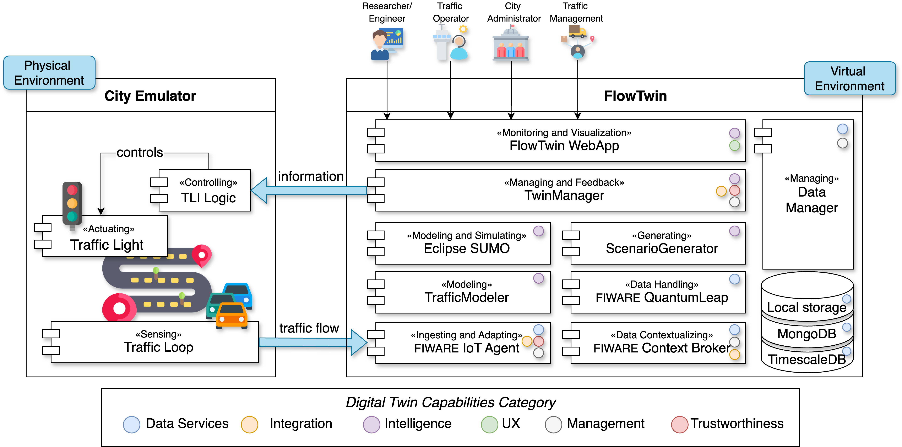

# **FlowTwin - Bologna Case Study**
**FlowTwin** is a framework designed to systematically integrate traffic flow modeling into a cohesive _Mobility Digital Twin_ (MoDT) system. This repository contains the application of this framework in the case study of the italian city of Bologna. The data used by this application are retrieved from the [Open Data Platform](https://opendata.comune.bologna.it/)
 of the municipality of Bologna, while the entire framework is implemented using _open-source technologies_ such as **FIWARE** components for interacting with the Digital Twin and **Eclipse Simulator of Urban MObility** (SUMO) for traffic modeling and simulations.
 The FlowTwin frameworl provides:
 
 1. Digital **representation** and state **simulation** to model the structural and behavioral aspects of Bologna's infrastructure and simulate traffic scenarios.  
   - [*Eclipse SUMO*](https://eclipse.dev/sumo/) is utilized for simulating through different traffic models.

2. **Bidirectional synchronization** to enable data flow from physical sensors to the Digital Twin and feedback from the Digital Twin to physical traffic light systems.  
   - [*FIWARE Generic Enablers*](https://www.fiware.org/catalogue/) (GEs) facilitate data exchange and management between the real system and its Digital Twin, ensuring semantic data interoperability.

3. **Traffic monitoring** to observe current traffic flow and stay updated on the state of Bologna City as well as simulation results based on dynamically generated scenarios.  
   - A [*Django WebApp*](https://www.djangoproject.com/), combined with a [*Grafana*](https://grafana.com/) dashboard, is implemented to:   
     *(i)* monitor the state of context entities modeled with FIWARE Smart Data Models,  
     *(ii)* track traffic flow patterns using the Grafana Dashboard,  
     *(iii)* select and calibrate traffic model for different simulating scenarios, and  
     *(iv)* visualize simulation results after the simulation is completed.

## FlowTwin Framework

The FlowTwin framework incorporates *open-source data* from the following sources:
* [**Bologna Open Data**](https://opendata.comune.bologna.it/):  Real traffic data from Bologna are collected. For more information, refer to the [*data README*](https://github.com/alessandrasomma28/MOBIDT/blob/main/data/README.md)
* [**OpenStreetMap**](https://www.openstreetmap.org/): The platform retrieves Bologna's road network layout and 
  additional infrastructure details, such as induction loops and traffic lights. For more information, refer to the 
  [*OSM README*](https://github.com/sommaalessandra/IntelliFlowTwin/tree/main/sumoenv)

<div align="center">
  
  <p><b>Figure 1:</b> FlowTwin Framework </p>
</div>

  The modules involved in FlowTwin are as follows:

1. **City Emulator (Mobility Virtual Environment)**: This module was introduced because direct access to Bologna's 
   real infrastructure is not feasible. As a result, FlowTwin incorporates a city
   emulator to ensure the presence of a continuously running physical counterpart in a Digital Twin context. Further details at [*CITY EMULATOR README*](https://github.com/sommaalessandra/IntelliFlowTwin/tree/main/mobilityvenv)

2. **FIWARE** [**Orion-LD Context Broker**](https://github.com/FIWARE/context.Orion-LD): This is the mandatory 
   component in any "powered by FIWARE" smart solution. It is responsible for managing context entities in compliance 
   with the *Next Generation Service Interface* (NGSI) protocol in Linked Data (LD) version. The current context 
   entities' state is stored in a **Mongo** database. Further details at [*FIWARE VENV README*](https://github.com/sommaalessandra/IntelliFlowTwin/tree/main/fiwareenv/README.md)

3. **FIWARE** [**IoT Agent - JSON**](https://github.com/telefonicaid/iotagent-json): This is the Internet of Things 
Agent (IOTA) for JSON-based protocols (with AMQP, HTTP, and MQTT transports). This IoT Agent acts as a bridge between 
JSON and the NGSI interface of the context broker, converting device-specific protocols into the NGSI standard. 
Devices sending measurements or receiving commands must be registered beforehand. Further details at [*FIWARE VENV 
README*](https://github.com/sommaalessandra/IntelliFlowTwin/tree/main/fiwareenv/README.md)

4. **FIWARE** [**QuantumLeap**](https://quantumleap.readthedocs.io/en/latest/): This is a time-based 
   data-persistence Generic Enabler subscribed to context updates, for storing and querying time-series data in 
   **Timescale**. QuantumLeap addresses the inherent limitation of the Context Broker, which only stores the current 
   state. Further details at [*FIWARE VENV README*](https://github.com/sommaalessandra/IntelliFlowTwin/tree/main/fiwareenv/README.md)

5. **Eclipse SUMO**: This is microscopic multi-modal traffic simulator that modeling individual road users, 
   including cars, buses, and pedestrians, enabling detailed analysis of traffic phenomena like congestion and 
   emissions. Simulation data inputs and outputs are locally stored. Further details at [*SUMO README*](https://github.com/sommaalessandra/IntelliFlowTwin/tree/main/sumoenv/README.md)

6. The **Digital Shadow Manager**, **Planner & Scenario Generator**, **Traffic Modeler**, and **Digital Twin Manager** are key Python 
   modules available in [**libraries**](https://github.com/sommaalessandra/IntelliFlowTwin/tree/main/libraries). These modules are responsible for generating digital shadows (temporal data traces), creating and executing simulation scenarios, planning actions to be performed in the physical system, selecting and calibrating macroscopic and microscopic traffic models for simulation purposes, and orchestrating the overall Digital Twin system, respectively. 

7. **Django WebApp & Grafana Dashboard** provides a user interface for monitoring (i) context entities modeled with FIWARE Smart Data Models, real-time traffic flow patterns, and simulation results.


### Device Compatibility

## FlowTwin Repository Structure
The repository is structured to support the **FlowTwin** framework, providing modules for data handling, traffic modeling and
simulation, Digital Twin modeling, and backend management. Below is the detailed structure of the repository:
```plaintext
├── IntelliFlowTwin
│   ├── data
│   │   ├── digitalshadow               # Contains the digital shadows used and updated in the platform.
│   │   ├── preprocessing
│   │   │   ├── preprocessingSetup.py   # Python script to handle data preprocessing.
│   │   │   └── README.md               # Documentation for preprocessing steps and files.
│   │   ├── realworlddata
│   │   │   ├── mvenvdata               # Traffic data used by the Bologna MVENV.
│   │   │   ├── opendata                # Traffic data retrieved by the Bologna Open Data.
│   │   └── README.md                   # Documentation for the folder, including details and potential updates 
│   │                                   # if the real dataset is modified.
│   │
│   ├── fiwareenv
│   │   ├── .env                        # Environment variables file for configuring FIWARE components.
│   │   ├── docker-compose.yml          # Docker Compose file for deploying FIWARE components.
│   │   └── README.md                   # Documentation for setting up the FIWARE environment.
│   │
│   ├── libraries
│   │   ├── classes
│   │   │   ├── Agent.py                # Manages interaction with FIWARE IoT Agent JSON.
│   │   │   ├── Broker.py               # Manages interaction with FIWARE Context Broker Orion-LD.
│   │   │   ├── DataManager.py          # Handles data storage and retrieval processes.
│   │   │   ├── DigitalShadowManager.py # Manages digital shadows for the simulation.
│   │   │   ├── DigitalTwinManager.py   # Orchestrates the Digital Twin system.
│   │   │   ├── Planner.py              # Implements planning actions and scenario generation.
│   │   │   ├── SubscriptionManager.py  # Manages subscriptions through FIWARE QuantumLeap.
│   │   │   ├── SumoSimulator.py        # Facilitates interaction with the SUMO Simulator.
│   │   │   └── TrafficModeler.py       # Configure and Calibrate macroscopic and microscopic traffic models.
│   │
│   ├── utils
│   │   ├── generalUtils.py             # Provides generic utility functions used across the project.
│   │   ├── preprocessingUtils.py       # Implements utilities for data preprocessing and transformation.
│   └── constants.py                # Stores constants such as configurations and file paths.
│   │
│   ├── mobilityvenv
│   │   ├── MobilityVirtualEnvironment.py # Defines the Mobility Virtual Environment.
│   │   ├── PhysicalSystemConnector.py    # Defines the connector within a physical system made of sensors and actuators.
│   │
│   ├── sumoenv
│   │   ├── standalone
│   │   │   └── (configuration files for standalone execution of Eclipse SUMO).
│   │   ├── static
│   │   │   └── (static files used for simulation).
│   │   ├── README.md                   # Documentation for configuring and executing the SUMO environment.
│   │   └── run.sumocfg                 # SUMO configuration file for executing traffic simulations.
│   │
│   ├── udtBackEnd
│   │   ├── udtApp                      # Contains application logic for the webApp backend.
│   │   ├── udtBackEnd                  # Handles backend functionality for the Digital Twin WebApp.
│   │   ├── db.sqlite3                  # SQLite database file storing application data.
│   │   ├── manage.py                   # Entry point for managing the WebApp backend.
│
├── LICENSE                             # Licensing information for the repository.
├── main.py                             # Main script for executing FlowTwin.
├── README.md                           # Documentation for understanding and using the repository.
├── requirements.txt                    # Lists all Python dependencies required for the project.
├── setup.bat                           # Batch script for setting up the environment on Windows.
```
## Framework Usage 
The framework was tested on the Windows OS and with the components installed in the following version:

- **Python 3.12**: Required to execute the core scripts and manage the environment. Install the latest version 
  from  [Python.org](https://www.python.org/downloads/).
- **Eclipse SUMO 1.21**: Necessary for traffic modeling and simulation. Download and install from [Eclipse SUMO](https://www.eclipse.org/sumo/).
- **Docker 27.3.1 (with Docker Compose)**: Required to deploy the FIWARE environment and associated components. Install the 
  latest versions from [Docker](https://www.docker.com/) and [Docker Compose](https://docs.docker.com/compose/).
- **Git**: Needed to clone the repository. Install Git from [Git SCM](https://git-scm.com/).
- **System Requirements**: Sufficient disk space and computational power to run Docker containers, execute Eclipse 
  simulator and store simulation results.
